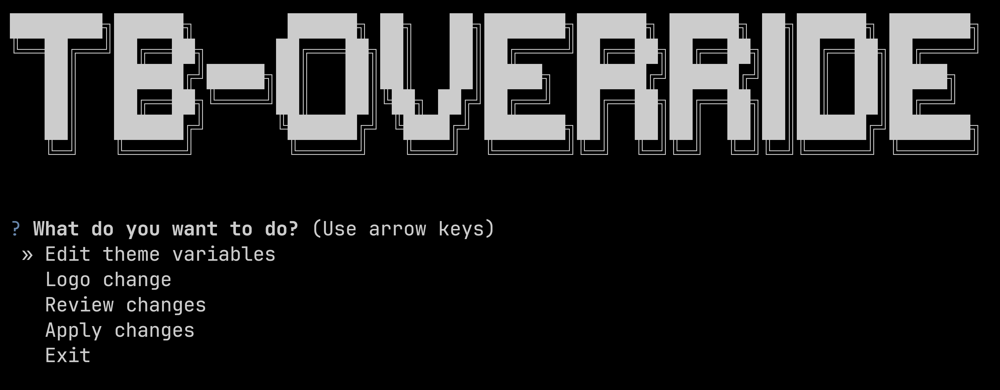

# TBOverride 🔧 - White label for ThingsBoard CE
NOTE: Under development 🚧
---

White-labeling / branding overrides for ThingsBoard Community Edition (CE)
Enable ThingsBoard CE white-labeling (also searched as whitelabeling, white labeling, white-labeling, whitelabelling) by applying repeatable overrides to UI assets and branding surfaces.

If you’re self-hosting ThingsBoard CE and want custom logo / favicon / title / login branding without upgrading editions, TBOverride is for you.

## What TBOverride does ✨

Rebrand ThingsBoard CE: replace logos, favicon, page title, and other UI assets

Automated apply workflow: one command to apply branding changes consistently

Deploy-friendly: works well with Docker + Nginx reverse proxy setups (and also plain Linux installs)

Repeatable: re-apply after upgrades or container rebuilds (because upgrades love resetting web assets)

## Why this exists 🧩

ThingsBoard Community Edition (CE) does not provide official “white-labeling” controls. TBOverride fills that gap by applying controlled overrides so you can brand your instance for internal use, clients, demos, or deployments.

## How it works (high level) 🧠

TBOverride applies your branding by doing one (or more) of these, depending on your setup:

Override static assets (logos, favicon, images) with your own files

Patch UI entry points (e.g., update references for logos/titles)

Optional reverse-proxy static mapping (serve your assets via Nginx at a predictable path)

The exact mechanics depend on whether you run ThingsBoard via Docker, deb/rpm, or behind Nginx.

## If you found this repo via one of these, you’re in the right place:

“thingsboard ce white labeling”

“thingsboard community edition whitelabel”

“thingsboard ce change logo”

“thingsboard ce custom branding”

“thingsboard ce favicon”

“thingsboard docker branding”

“thingsboard nginx override static assets”

“thingsboard ui customization”
